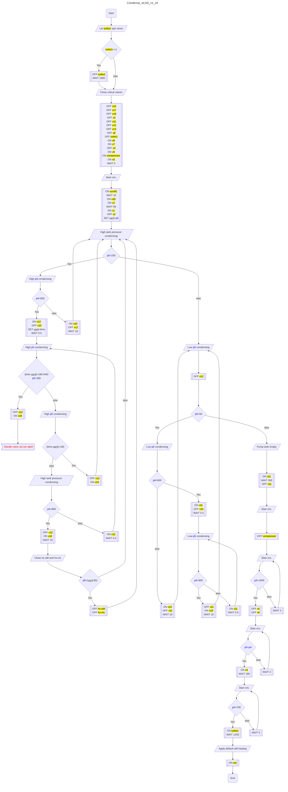

# 1. Condense_wLN2

> ver: v1_24

## 1.1. workflow

```mermaid
---
title: Condense_wLN2_v1_24
---
flowchart TD
    START(Start) --> STATE400

    STATE400[/Let <mark>turbo1</mark> spin down/] --> STATE400IF{<mark>turbo1</mark>==1}
    STATE400IF -->|Yes| STATE400IFDO[[
        OFF <mark>turbo1</mark>
        WAIT 1800
    ]]
    STATE400IFDO --> STATE401
    STATE400IF -->|else| STATE401

    STATE401[/Close critical valves/] --> STATE401DO[[
        OFF <mark>v15</mark>
        OFF <mark>v17</mark>
        OFF <mark>v18</mark>
        OFF <mark>v3</mark>
        OFF <mark>v11</mark>
        OFF <mark>v12</mark>
        OFF <mark>v13</mark>
        OFF <mark>v8</mark>
        OFF <mark>turbo1</mark>
        ON <mark>v9</mark>
        ON <mark>v7</mark>
        OFF <mark>v4</mark>
        ON <mark>v6</mark>
        ON <mark>compressor</mark>
        ON <mark>v5</mark>
        WAIT 5
    ]]
    STATE401DO --> STATE402

    STATE402[/Start circ./] --> STATE402DO[[
        ON <mark>scroll1</mark>
        WAIT 10
        ON <mark>v10</mark>
        ON <mark>v2</mark>
        WAIT 60
        ON <mark>v1</mark>
        OFF <mark>v2</mark>
        SET <u>var3</u>=<font color="#0000FF">p5</font>
    ]]
    STATE402DO --> STATE410

    STATE410[/High tank pressure condensing/] --> STATE410IF{<font color="#0000FF">p5</font>>250}
    STATE410IF -->|Yes| STATE411
    STATE410IF ----->|else| STATE420

    STATE411[/High <font color="#0000FF">p5</font> condensing/] --> STATE411IF{<font color="#0000FF">p4</font><600}
    STATE411IF -->|Yes| STATE411DO[[
        ON <mark>v12</mark>
        OFF <mark>v10</mark>
        SET <u>var4</u>=time
        WAIT 0.5
    ]]
    STATE411DO --> STATE412
    STATE411IF -->|else| STATE411DOELSE[[
        ON <mark>v10</mark>
        OFF <mark>v12</mark>
        WAIT 10
    ]]
    STATE411DOELSE --> STATE410

    STATE412[/High <font color="#0000FF">p5</font> condensing/] --> STATE412IF{"
        (time-<u>var4</u>)>180 AND
        <font color="#0000FF">p5</font>>300
    "}
    STATE412IF -->|Yes| STATE412IFDO[[
        OFF <mark>v12</mark>
        ON <mark>v10</mark>
    ]]
    STATE412IFDO --> ERROR1>"<font color="#FF0000"><i>Needle valve set too tight!</i></font>"]
    STATE412IF -->|else| STATE413

    STATE413[/High <font color="#0000FF">p5</font> condensing/] --> STATE413IF{"(time-<u>var4</u>)>180"}
    STATE413IF -->|else| STATE414
    STATE413IF -->|Yes| STATE413DO[[
        OFF <mark>v12</mark>
        ON <mark>v10</mark>
    ]]
    STATE413DO --> STATE410

    STATE414[/High tank pressure condensing/] --> STATE414IF{<font color="#0000FF">p4</font>>900}
    STATE414IF -->|Yes| STATE414DO[[
        OFF <mark>v12</mark>
        ON <mark>v10</mark>
        WAIT 10
    ]]
    STATE414DO --> STATE415
    STATE414IF -->|else| STATE414DOELSE[[
        ON <mark>v12</mark>
        WAIT 0.5
    ]]
    STATE414DOELSE --> STATE412

    STATE415[/Close hs-still and hs-mc/] --> STATE415IF{"<font color="#0000FF">p5</font><(<u>var3</u>-80)"}
    STATE415IF -->|Yes| STATE415DO[[
        OFF <mark>hs-still</mark>
        OFF <mark>hs-mc</mark>
    ]]
    STATE415DO --> STATE410
    STATE415IF -->|else| STATE410

    STATE420[/Low <font color="#0000FF">p5</font> condensing/] --> STATE420DO[[OFF <mark>v12</mark>]]

    STATE420DO --> STATE420IF{<font color="#0000FF">p5</font>>50}
    STATE420IF -->|else| STATE430
    STATE420IF -->|Yes| STATE421

    STATE421[/Low <font color="#0000FF">p5</font> condensing/] --> STATE421IF{<font color="#0000FF">p4</font><600}
    STATE421IF -->|Yes| STATE421IFDO[[
        ON <mark>v11</mark>
        OFF <mark>v10</mark>
        WAIT 0.5
    ]]
    STATE421IFDO --> STATE422
    STATE421IF ------>|else| STATE421DOELSE[[
        ON <mark>v10</mark>
        OFF <mark>v11</mark>
        WAIT 10
    ]]
    STATE421DOELSE --> STATE420

    STATE422[/Low <font color="#0000FF">p5</font> condensing/] ---> STATE422IF{<font color="#0000FF">p4</font>>900}
    STATE422IF -->|Yes| STATE422DO[[
        OFF <mark>v11</mark>
        ON <mark>v10</mark>
        WAIT 10
    ]]
    STATE422DO --> STATE420
    STATE422IF -->|else| STATE422DOELSE[[
        ON <mark>v11</mark>
        WAIT 0.5
    ]]
    STATE422DOELSE --> STATE422

    STATE430[/Pump tank empty/] --> STATE430DO[[
        ON <mark>v11</mark>
        WAIT 300
        OFF <mark>v11</mark>
    ]]
    STATE430DO --> STATE440

    STATE440[/Start circ./] --> STATE440DO[[
        OFF <mark>compressor</mark>
    ]]
    STATE440DO --> STATE441

    STATE441[/Start circ./] --> STATE441IF{<font color="#0000FF">p3</font><1000}
    STATE441IF -->|Yes| STATE441DO[[
        OFF <mark>v5</mark>
        OFF <mark>v6</mark>
    ]]
    STATE441DO --> STATE442
    STATE441IF -->|else| STATE441IFELSEWAIT[[WAIT 2]]
    STATE441IFELSEWAIT --> STATE441

    STATE442[/Start circ./] --> STATE442IF{<font color="#0000FF">p3</font><<font color="#0000FF">p4</font>}
    STATE442IF -->|Yes| STATE442DO[[
        ON <mark>v4</mark>
        WAIT 180
    ]]
    STATE442DO --> STATE443
    STATE442IF -->|else| STATE442IFELSEWAIT[[WAIT 2]]
    STATE442IFELSEWAIT --> STATE442

    STATE443[/Start circ./] --> STATE443IF{<font color="#0000FF">p3</font><700}
    STATE443IF -->|Yes| STATE443DO[[
        ON <mark>turbo1</mark>
        WAIT 1200
    ]]
    STATE443DO --> STATE444
    STATE443IF -->|else| STATE443IFELSEWAIT[[WAIT 5]]
    STATE443IFELSEWAIT --> STATE443

    STATE444[/Apply default still heating/] --> STATE444DO[[
        ON <mark>ext</mark>
    ]]
    STATE444DO --> END(End)
```

# 2. END
