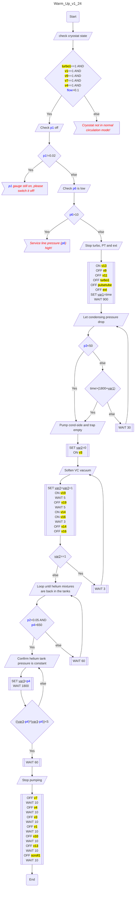

# 1. Warm_Up

> ver: v1_24

## 1.1. workflow

```mermaid
---
title: Warm_Up_v1_24
---
flowchart TD
    START(Start) --> STATE500

    STATE500[/check cryostat state/] --> STATE500IF{
        <mark>turbo1</mark>==1 AND
        <mark>v1</mark>==1 AND
        <mark>v9</mark>==1 AND
        <mark>v7</mark>==1 AND
        <mark>v4</mark>==1 AND
        <font color="#0000FF">flow</font>>0.1
    }
    STATE500IF -->|Yes| STATE501
    STATE500IF -->|else| ERROR1><font color="#FF0000"><i>Cryostat not in normal circulation mode!</i></font>]

    STATE501[/Check <font color="#0000FF">p1</font> off/] --> STATE501IF{<font color="#0000FF">p1</font>!=0.02}
    STATE501IF -->|Yes| ERROR2><font color="#FF0000"><i><font color="#0000FF">p1</font> gauge still on, please switch it off!</i></font>]
    STATE501IF -->|else| STATE502

    STATE502[/Check <font color="#0000FF">p6</font> is low/] --> STATE502IF{<font color="#0000FF">p6</font>>10}
    STATE502IF -->|Yes| ERROR3>"<font color="#FF0000"><i>Service line pressure (<font color="#0000FF">p6</font>) high!</i></font>"]
    STATE502IF -->|else| STATE510

    STATE510[/Stop turbo, PT and ext/] --> STATE510DO[[
        ON <mark>v13</mark>
        OFF <mark>v9</mark>
        OFF <mark>v11</mark>
        OFF <mark>turbo1</mark>
        OFF <mark>pulsetube</mark>
        OFF <mark>ext</mark>
        SET <u>var1</u>=time
        WAIT 900
    ]]
    STATE510DO --> STATE511

    STATE511[/Let condensing pressure drop/] --> STATE511IF{<font color="#0000FF">p3</font><50}
    STATE511IF -->|Yes| STATE512
    STATE511IF -->|else| STATE511IFELSEIF{"time>(1800+<u>var1</u>)"}
        STATE511IFELSEIF -->|Yes| STATE512
        STATE511IFELSEIF -->|else| STATE511IFELSEIFWAIT[[WAIT 30]]
        STATE511IFELSEIFWAIT --> STATE511

    STATE512[/Pump cond-side and trap empty/] --> STATE512DO[[
        SET <u>var2</u>=0
        ON <mark>v3</mark>
    ]]
    STATE512DO --> STATE513

    STATE513[/Soften VC vacuum/] --> STATE513DO[[
        SET <u>var2</u>=<u>var2</u>+1
        ON <mark>v19</mark>
        WAIT 5
        OFF <mark>v19</mark>
        WAIT 5
        ON <mark>v14</mark>
        ON <mark>v16</mark>
        WAIT 3
        OFF <mark>v14</mark>
        OFF <mark>v16</mark>
    ]]
    STATE513DO --> STATE516IF{<u>var2</u>==1}
    STATE516IF -->|else| STATE520
    STATE516IF -->|Yes| STATE516IFWAIT[[WAIT 3]]
    STATE516IFWAIT --> STATE513

    STATE520[/
        Loop until helium mixtures
        are back in the tanks
    /] --> STATE520IF{
        <font color="#0000FF">p2</font><0.05 AND
        <font color="#0000FF">p4</font>>650
    }
    STATE520IF -->|Yes| STATE521
    STATE520IF -->|else| STATE520IFWAIT[[WAIT 60]]
    STATE520IFWAIT --> STATE520

    STATE521[/Confirm helium tank pressure is constant/] --> STATE521DO[[
        SET <u>var3</u>=<font color="#0000FF">p4</font>
        WAIT 1800
    ]]
    STATE521DO --> STATE522IF{"((<u>var3</u>-<font color="#0000FF">p4</font>)*(<u>var3</u>-<font color="#0000FF">p4</font>))<5"}
    STATE522IF -->|Yes| STATE522IFWAIT[[WAIT 60]]
    STATE522IFWAIT --> STATE530
    STATE522IF -->|else| STATE521

    STATE530[/Stop pumping/] --> STATE530DO[[
        OFF <mark>v7</mark>
        WAIT 10
        OFF <mark>v4</mark>
        WAIT 10
        OFF <mark>v3</mark>
        WAIT 10
        OFF <mark>v1</mark>
        WAIT 10
        OFF <mark>v10</mark>
        WAIT 10
        OFF <mark>v13</mark>
        WAIT 10
        OFF <mark>scroll1</mark>
        WAIT 10
    ]]
    STATE530DO --> END(End)
```

# 2. END
